# Red Social
* **Track:** _Common Core_
* **Sprint 03:** _JQuery_
* **Unidad:** _04_

## Objetivo
Crear una red social para un emprendedor. Debe estr enfocada en los usuarios.

## Requisitos.

* Perfiles de usuarios.
* Newsfeed para ver las actualizaciones.
* Espacio para escribir posts.
* Lugar para subir fotos.
* Capacidad para agregar, seguir y marcar contactos.
* Ser mobile friendly.

## Flujo de trabajo

1. Definir tema y objetivo de la red.

2. Establecer rutas de trabajo y medios de comunicación en el equipo.

3. Investigación sobre los usuarios, medio e industria.

4. Análisis de la información.

5. Detección de desafios a resolver.

6. Sketch del diseño.

7. Establecer estructura de carpetas con los archivos necesarios para el proyecto.

8. Escribir pseudo código para identificar funcionalidad requerida.

9. Realizar el marcado del contenido en un archivo html.

10. Desarrollar funcionalidad.

11. Establecer estilos en archivo css.

12. Aplicar los principios de diseño responsive (media queries) para conseguir el objetivo del ejercicio.

13. Realizar primera prueba.

14. Realizar mejoras y modificaciones en relación a los resultados de la prueba.

15. Realizar segunda prueba.

16. Ajustes finales.

17. Crear archivo README.

18. Subir a repositorio Git y crear GHpage correspondiente.

19. Condensar información y realizar presentación.

## Consideraciones

* Se agregaron modales de:
  -Registro
  -Recuperación de contraseña
  -Términos y servicios

* En la carpeta docs se puede encontrar la siguiente información:
        UX:       Presentación PowerPoint Pitch del Proyecto.
                  Sketches.
                  Wireframes.
        UI:       Style Guide.
        Frontend: Backlog.   
                  Pseudocódigo.

## Sketches
* Splash

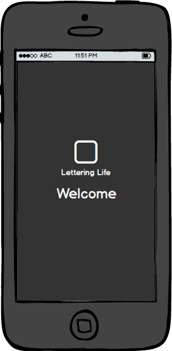

* Login

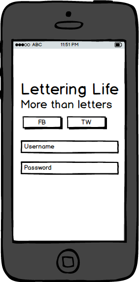

* Signup

* Recovery

* Home

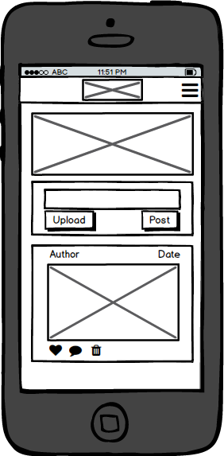

* Profile

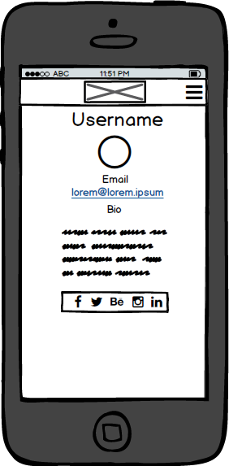

* Friends

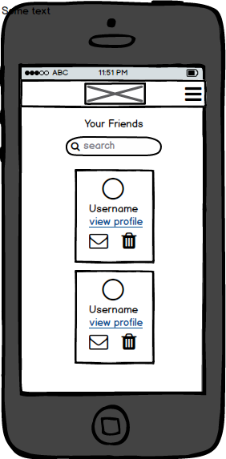

* Settings

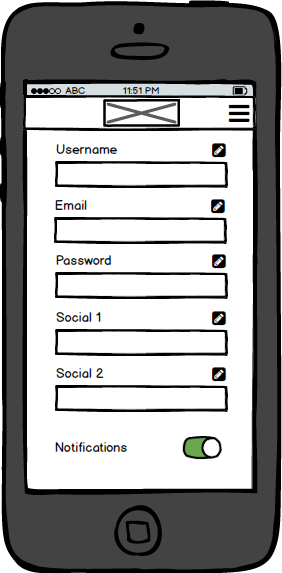

* Logout

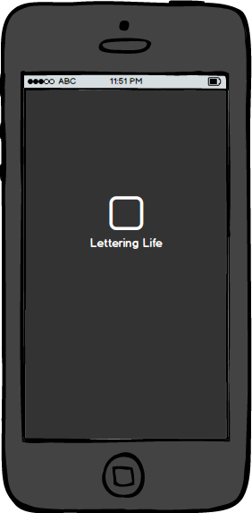

## Wireframes

* Splash

* Login

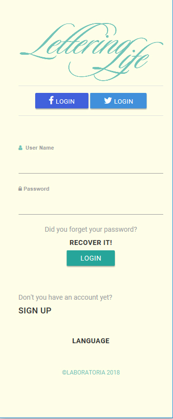

* Signup

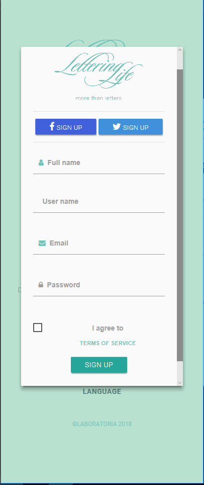

* Recovery

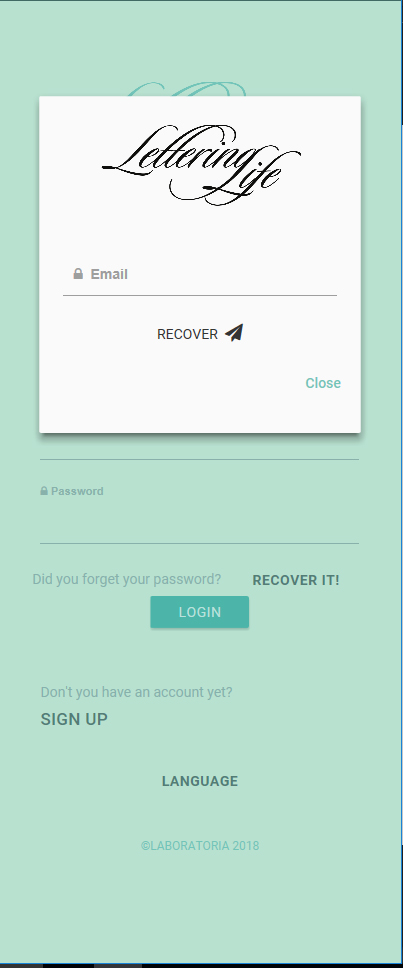

* Home

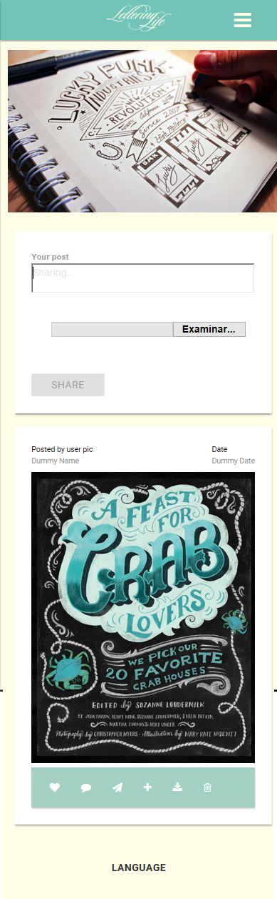

* Profile

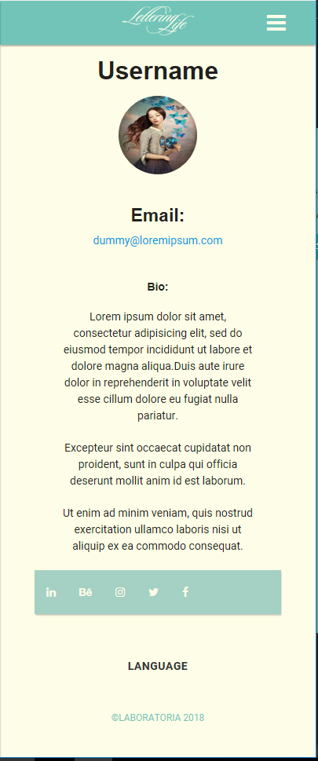

* Friends

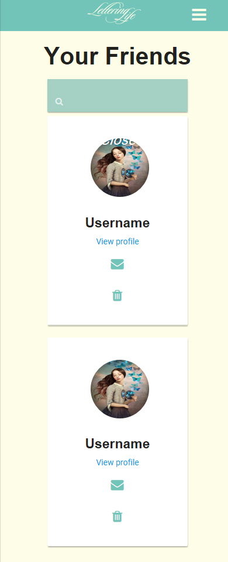

* Settings

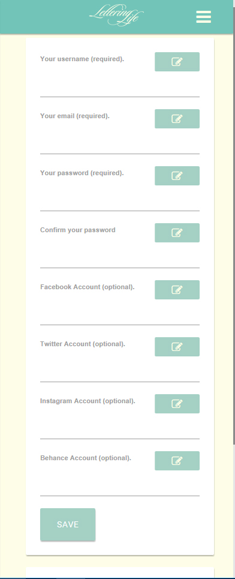

* Logout

## Style Guide

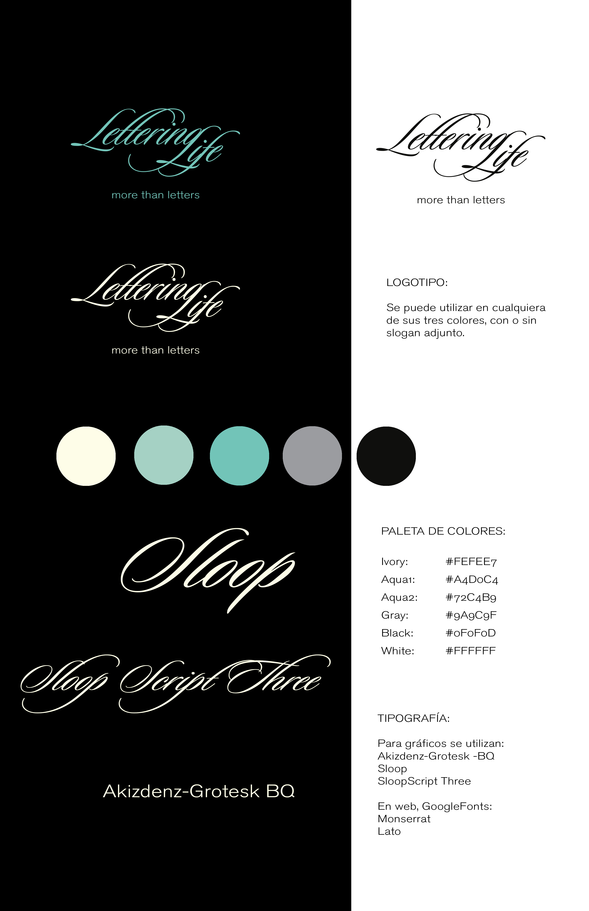
